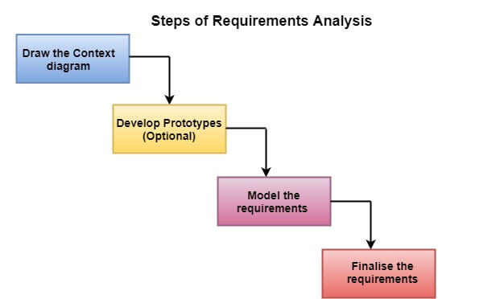
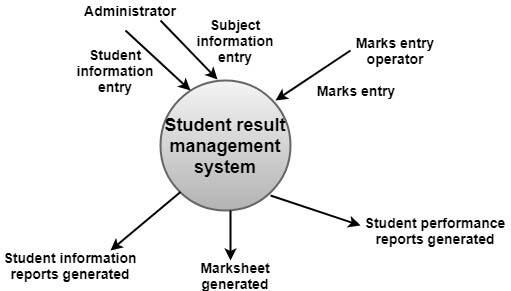

[**_``Go Back``_**](../README.md)

# Software Requirement Analysis and Specification

## System & Softyware Requirements
----------------------------------

``System Requirement``

>todo

``Softyware Requirements``

>todo

## Types of Software Requirements
----------------------------------

Following are the types of Software Requirements

- Functional Requirements
- Non-Functional Requirements
- Domain Requirements
- User Requirements

### Functional Requirements
Requirements, which are related to functional aspect of software fall into this category.
They define functions and functionality within and from the software system.

### Non-Functional Requirements
These are basically the quality constraints that the system must satisfy according to the project contract. The priority or extent to which these factors are implemented varies from one project to other. They are also called non-behavioral requirements. They basically deal with issues like:

- Portability
- Security
- Maintainability
- Reliability
- Scalability
- Performance
- Reusability
- Flexibility

### Domain Requirements
Domain requirements are the requirements which are characteristic of a particular category or domain of projects. The basic functions that a system of a specific domain must necessarily exhibit come under this category. For instance, in an academic software that maintains records of a school or college, the functionality of being able to access the list of faculty and list of students of each grade is a domain requirement. These requirements are therefore identified from that domain model and are not user specific.

### User Requirements
User requirements are just what the name implies.  They are requirements set by the end user.  These requirements express how a facility, equipment or process should perform in terms of the product to be manufactured, required throughput, and conditions in which product should be made.

## Elicitation & Analysis of Requirements
-----------------------------------------

### Requirements Elicitation

Requirements elicitation is perhaps the most difficult, most error-prone and most communication intensive software development. It can be successful only through an effective customer-developer partnership. It is needed to know what the users really need. 

**Requirements elicitation Activities**

Requirements elicitation includes the subsequent activities. Few of them are listed below:

- Knowledge of the overall area where the systems is applied.
- The details of the precise customer problem where the system are going to be applied must be understood.
- Interaction of system with external requirements.
- Detailed investigation of user needs.
- Define the constraints for system development.

**Requirements elicitation Methods**

There are a number of requirements elicitation methods. Few of them are listed below:

- Interviews
- Brainstorming Sessions
- Facilitated Application Specification Technique (FAST)
- Quality Function Deployment (QFD)
- Use Case Approach

### Analysis of Requirements

Requirement analysis is significant and essential activity after elicitation. We analyze, refine, and scrutinize the gathered requirements to make consistent and unambiguous requirements. This activity reviews all requirements and may provide a graphical view of the entire system. After the completion of the analysis, it is expected that the understandability of the project may improve significantly. Here, we may also use the interaction with the customer to clarify points of confusion and to understand which requirements are more important than others.

**Step of Requirements Analysis**

#### ``Draw the context diagram`` 

The context diagram is a simple model that defines the boundaries and interfaces of the proposed systems with the external world. It identifies the entities outside the proposed system that interact with the system. The context diagram of student result management system is given below:

####  ``Development of a Prototype (optional)``

One effective way to find out what the customer wants is to construct a prototype, something that looks and preferably acts as part of the system they say they want.

#### ``Model the requirements``

This process usually consists of various graphical representations of the functions, data entities, external entities, and the relationships between them. The graphical view may help to find incorrect, inconsistent, missing, and superfluous requirements. Such models include the Data Flow diagram, Entity-Relationship diagram, Data Dictionaries, State-transition diagrams, etc.

#### ``Finalise the requirements``

After modeling the requirements, we will have a better understanding of the system behavior. The inconsistencies and ambiguities have been identified and corrected. The flow of data amongst various modules has been analyzed. Elicitation and analyze activities have provided better insight into the system. Now we finalize the analyzed requirements, and the next step is to document these requirements in a prescribed format.

## Overview of Technique
------------------------

### ``View Point``

Viewpoint-oriented approaches to requirements engineering (Mullery, 1979) (Finkelstein, et al., 1992) (Kotonya and Sommerville, 1996, Kotonya and Sommerville, 1992) organise both the elicitation process and the requirements themselves using different viewpoints. A viewpoint is a way of organising the requirements for a software system, based on some perspective such as an end-user perspective or a manager's perspective.

### ``Interview``

Interviews of stakeholders and users are critical to creating the great software. Without understanding the goals and expectations of the users and stakeholders, we are very unlikely to satisfy them. We also have to recognize the perspective of each interviewee, so that, we can properly weigh and address their inputs. Listening is the skill that helps a great analyst to get more value from an interview than an average analyst.

### ``Ethnography``

Ethnography is a qualitative research method used to study people and cultures. It is largely adopted in disciplines outside software engineering, including different areas of computer science. Ethnography can provide an in-depth understanding of the socio-technological realities surrounding everyday software development practice, i.e., it can help to uncover not only what practitioners do, but also why they do it

## Requirement Validation
--------------------------

``Requirements validation`` is the process of checking that requirements defined for development, define the system that the customer really wants. To check issues related to requirements, we perform requirements validation. We usually use requirements validation to check error at the initial phase of development as the error may increase excessive rework when detected later in the development process.

In the requirements validation process, we perform a different type of test to check the requirements mentioned in the Software Requirements Specification (SRS), these checks include:

- ``Completeness checks``
- ``Consistency checks``
- ``Validity checks``
- ``Realism checks``
- ``Ambiguity checks``
- ``Verifiability``

## Requirement Statement
-------------------------
The production of the requirements stage of the software development process is Software Requirements Specifications (SRS) (also called a requirements document). This report lays a foundation for software engineering activities and is constructing when entire requirements are elicited and analyzed. SRS is a formal report, which acts as a representation of software that enables the customers to review whether it (SRS) is according to their requirements. Also, it comprises user requirements for a system as well as detailed specifications of the system requirements.

The SRS is a specification for a specific software product, program, or set of applications that perform particular functions in a specific environment. It serves several goals depending on who is writing it. First, the SRS could be written by the client of a system. Second, the SRS could be written by a developer of the system. The two methods create entirely various situations and establish different purposes for the document altogether. The first case, SRS, is used to define the needs and expectation of the users. The second case, SRS, is written for various purposes and serves as a contract document between customer and developer.

**Following are the features of a good SRS document**

- ``Correctness``
- ``Complete``
- ``Consistancy``
- ``Unambiguousness``
- ``Ranking for importance and stability``
- ``Modifiability``

## Feasibity
-------------
``Feasibility Study`` in Software Engineering is a study to evaluate feasibility of proposed project or system. Feasibility study is one of stage among important four stages of Software Project Management Process. As name suggests feasibility study is the feasibility analysis or it is a measure of the software product in terms of how much beneficial product development will be for the organization in a practical point of view. Feasibility study is carried out based on many purposes to analyze whether software product will be right in terms of development, implantation, contribution of project to the organization etc. 

**Types of Feasibility Study**

The feasibility study mainly concentrates on below five mentioned areas. Among these Economic Feasibility Study is most important part of the feasibility analysis and Legal Feasibility Study is less considered feasibility analysis. 

- ``Technical Feasibility`` : In Technical Feasibility current resources both hardware software along with required technology are analyzed/assessed to develop project. This technical feasibility study gives report whether there exists correct required resources and technologies which will be used for project development. Along with this, feasibility study also analyzes technical skills and capabilities of technical team, existing technology can be used or not, maintenance and up-gradation is easy or not for chosen technology etc.  

- ``Operational Feasibility`` : In Operational Feasibility degree of providing service to requirements is analyzed along with how much easy product will be to operate and maintenance after deployment. Along with this other operational scopes are determining usability of product, Determining suggested solution by software development team is acceptable or not etc. 

- ``Economic Feasibility`` : In Economic Feasibility study cost and benefit of the project is analyzed. Means under this feasibility study a detail analysis is carried out what will be cost of the project for development which includes all required cost for final development like hardware and software resource required, design and development cost and operational cost and so on. After that it is analyzed whether project will be beneficial in terms of finance for organization or not. 

- ``Legal Feasibility`` : In Legal Feasibility study project is analyzed in legality point of view. This includes analyzing barriers of legal implementation of project, data protection acts or social media laws, project certificate, license, copyright etc. Overall it can be said that Legal Feasibility Study is study to know if proposed project conform legal and ethical requirements. 

- ``Schedule Feasibility`` : In Schedule Feasibility Study mainly timelines/deadlines is analyzed for proposed project which includes how many times teams will take to complete final project which has a great impact on the organization as purpose of project may fail if it can’t be completed on time. 

**Feasibility Study Process** 

The below steps are carried out during entire feasibility analysis. 

- Information assessment
- Information collection
- Report writing
- General information