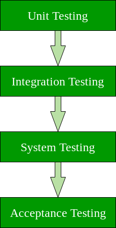
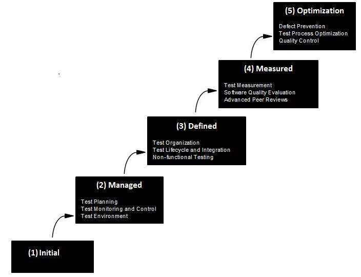

<div align="center">

[**_``Go Back``_**](../README.md)

# Software Testing and Quality Assurance

</div>

## Varification and Validation
------------------------------

``Verification`` and ``Validation`` is the process of investigating that a software system satisfies specifications and standards and it fulfills the required purpose. ``Barry Boehm`` described verification and validation as the following:

```
Verification: Are we building the product right?
Validation: Are we building the right product?
```

**``Verification``**

Verification is the process of checking that a software achieves its goal without any bugs. It is the process to ensure whether the product that is developed is right or not. It verifies whether the developed product fulfills the requirements that we have. ``Verification`` is ``Static Testing``.

Activities involved in verification:

- Inspections
- Reviews
- Walkthroughs
- Desk-checking

**``Validation``**

Validation is the process of checking whether the software product is up to the mark or in other words product has high level requirements. It is the process of checking the validation of product i.e. it checks what we are developing is the right product. it is validation of actual and expected product. ``Validation`` is the ``Dynamic Testing``.

Activities involved in validation:

- Black box testing
- White box testing
- Unit testing
- Integration testing


## Technique of Testing
------------------------------

Software testing techniques can be majorly classified into two categories: 

- ``Black Box Testing`` : The technique of testing in which the tester doesn’t have access to the source code of the software and is conducted at the software interface without any concern with the internal logical structure of the software is known as ``black-box testing``. 

- ``White-Box Testing`` : The technique of testing in which the tester is aware of the internal workings of the product, has access to its source code, and is conducted by making sure that all internal operations are performed according to the specifications is known as ``white box testing``.

|                  Black Box Testing                    |                      White Box Testing                    |
|-------------------------------------------------------|-----------------------------------------------------------|
|Internal workings of an application are not required   | Knowledge of the internal workings is a must.             |
|Also known as closed box/data-driven testing.          | Also known as clear box/structural testing.               |
|End users, testers, and developers.                    | Normally done by testers and developers.                  |
|This can only be done by a trial and error method.     | Data domains and internal boundaries can be better tested.|

## Inpections
---------------

The term ``software inspection`` was developed by ``IBM`` in the early ``1970s``, when it was noticed that the testing was not enough sufficient to attain high quality software for large applications. 

``Inspection`` is used to determine the defects in the code and remove it efficiently. This prevents defects and enhances the quality of testing to remove defects. This software inspection method achieved the highest level for efficiently removing defects and improving software quality. 

There are some factors that generate the high quality software:

- ``Phrases quality design inspection and Code inspections``: This factor refers to formal oversight that follows protocols such as training. Participants, material distributed for inspection. Both moderators and recorders are present to analyze defect statistics. 
- ``Phrase quality assurance``: This factor refers to an active software quality assurance group, which joins a group of software developments to support them in the development of high quality software. 
- ``Formal Testing``: It throws the test process under certain conditions 
    - For an application, a test plan was created. 
    - Are complete specifications so that test cases can be made without significant gaps. 
    - Vast library control tools are used. 
    - Test coverage analysis tools are used. 

- ``Software Inspection Process`` : The inspection process was developed in the mid 1970s, later extended and revised. The process must have an entry criterion that determines whether the inspection process is ready to begin. this prevents incomplete products from entering the inspection process. Entry criteria can be interstitial with items such as “The Spell-Document Check". 
There are some of the stages in the software inspection process such as- 

    - ``Planning`` : The moderator plan the inspection. 
    - ``Overview Meeting``: The background of the work product is described by the author. 
    - ``Preparation``: The examination of the work product is done by inspector to identify the possible defects. 
    - ``Inspection Meeting``: The reader reads the work product part by part during this meeting and the inspectors the faults of each part. 
    - ``Rework``: After the inspection meeting, the writer changes the work product according to the work plans. 
    - ``Follow Up``: The changes done by the author are checked to make sure that everything is correct. 

**Advantages of Software Inspection**

- Helps in the Early removal of major defects.
- This inspection enables a numeric quality assessment of any technical document.
- Software inspection helps in process improvement.
- It helps in staff training on the job.
- Software inspection helps in gradual productivity improvement.

**Disadvantages of Software Inspection**
 
- It is a time-consuming process.
- Software inspection requires discipline.

## Level of Testing
----------------------

There are mainly four Levels of Testing:

- ``Unit Testing``: A level of the software testing process where individual units/components of a software/system are tested. The purpose is to validate that each unit of the software performs as designed. 

- ``Integration Testing``: A level of the software testing process where individual units are combined and tested as a group. The purpose of this level of testing is to expose faults in the interaction between integrated units. 

- ``System Testing``: A level of the software testing process where a complete, integrated system/software is tested. The purpose of this test is to evaluate the system’s compliance with the specified requirements. 

- ``Acceptance Testing``: A level of the software testing process where a system is tested for acceptability. The purpose of this test is to evaluate the system’s compliance with the business requirements and assess whether it is acceptable for delivery. 

<div align="center">



</div>

**Others**

- ``Interface Testing``:Interface Testing is defined as a software testing type which verifies whether the communication between two different software systems is done correctly. A connection that integrates two components is called interface. This interface in a computer world could be anything like API’s, web services, etc. Testing of these connecting services or interface is referred to as Interface Testing. An interface is actually software that consists of sets of commands, messages, and other attributes that enable communication between a device and a user.

- ``Alpha Testing``:Alpha Testing is a type of software testing performed to identify bugs before releasing the product to real users or to the public. Alpha Testing is one of the user acceptance tests.

- ``Beta Testing``:Beta Testing is performed by real users of the software application in a real environment. Beta testing is one type of User Acceptance Testing. 

- ``Regression Testing``:Regression Testing is defined as a type of software testing to confirm that a recent program or code change has not adversely affected existing features. Regression Testing is nothing but a full or partial selection of already executed test cases which are re-executed to ensure existing functionalities work fine.

## Design of Test Case
----------------------

**What is a Test Case?**

A ``Test Case`` is a set of actions executed to verify a particular feature or functionality of your software application. A Test Case contains test steps, test data, precondition, postcondition developed for specific test scenario to verify any requirement. The test case includes specific variables or conditions, using which a testing engineer can compare expected and actual results to determine whether a software product is functioning as per the requirements of the customer.

> todo

## Quality Management Activities
--------------------------------
Software Quality Management ensures that the required level of quality is achieved by submitting improvements to the product development process. SQA aims to develop a culture within the team and it is seen as everyone's responsibility.

Software Quality management should be independent of project management to ensure independence of cost and schedule adherences. It directly affects the process quality and indirectly affects the product quality.

**Activities of Software Quality Management:**

- ``Quality Assurance`` : QA aims at developing Organizational procedures and standards for quality at Organizational level.

- ``Quality Planning`` : Select applicable procedures and standards for a particular project and modify as required to develop a quality plan.

- ``Quality Control`` : Ensure that best practices and standards are followed by the software development team to produce quality products.

## Product & Process Quality
--------------------------------

**``Product``**

In the context of software engineering, Product includes any software manufactured based on the customer’s request. This can be a problem solving software or computer based system. It can also be said that this is the result of a project. 

**``Process``**

Process is a set of sequence steps that have to be followed to create a project. The main purpose of a process is to improve the quality of the project. The process serves as a template that can be used through the creation of its examples and is used to direct the project. 

The main difference between a process and a product is that the process is a set of steps that guide the project to achieve a convenient product. while on the other hand, the product is the result of a project that is manufactured by a wide variety of people. 

> todo

## Standards : ISO 9000

The International organization for Standardization is a world wide federation of national standard bodies. The ``International standards organization (ISO)`` is a standard which serves as a for contract between independent parties. It specifies guidelines for development of quality system.

Quality system of an organization means the various activities related to its products or services. Standard of ISO addresses to both aspects i.e. operational and organizational aspects which includes responsibilities, reporting etc. An ISO 9000 standard contains set of guidelines of production process without considering product itself.

**Why ISO Certification required by Software Industry?**

There are several reasons why software industry must get an ISO certification. Some of reasons are as follows :

- This certification has become a standards for international bidding.
- It helps in designing high-quality repeatable software products.
- It emphasis need for proper documentation.
- It facilitates development of optimal processes and totally quality measurements.

## Capability Maturity Model (CMM)
------------------------------------

``CMM`` was developed by the ``Software Engineering Institute (SEI)`` at Carnegie Mellon University in ``1987``. Capability Maturity Model (CMM) specifies an increasing series of levels of a software development organization. The higher the level, the better the software development process, hence reaching each level is an expensive and time-consuming process.

### **Levels of CMM**

<div align="center">



</div>

- ``Level One :Initial`` - The software process is characterized as inconsistent, and occasionally even chaotic. Defined processes and standard practices that exist are abandoned during a crisis. Success of the organization majorly depends on an individual effort, talent, and heroics. The heroes eventually move on to other organizations taking their wealth of knowledge or lessons learnt with them.

- ``Level Two: Repeatable`` - This level of Software Development Organization has a basic and consistent project management processes to track cost, schedule, and functionality. The process is in place to repeat the earlier successes on projects with similar applications. Program management is a key characteristic of a level two organization.

- ``Level Three: Defined`` - The software process for both management and engineering activities are documented, standardized, and integrated into a standard software process for the entire organization and all projects across the organization use an approved, tailored version of the organization's standard software process for developing,testing and maintaining the application.

- ``Level Four: Managed`` - Management can effectively control the software development effort using precise measurements. At this level, organization set a quantitative quality goal for both software process and software maintenance. At this maturity level, the performance of processes is controlled using statistical and other quantitative techniques, and is quantitatively predictable.

- ``Level Five: Optimizing`` - The Key characteristic of this level is focusing on continually improving process performance through both incremental and innovative technological improvements. At this level, changes to the process are to improve the process performance and at the same time maintaining statistical probability to achieve the established quantitative process-improvement objectives.
