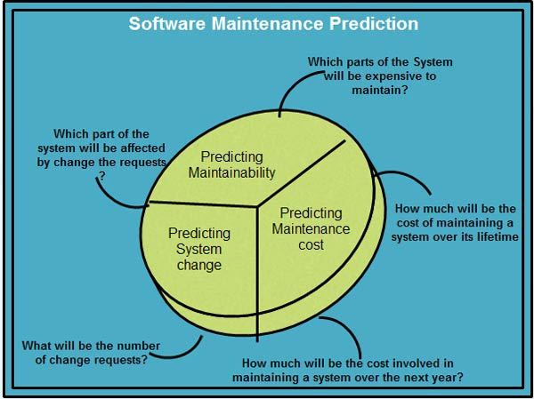

[**_``Go Back``_**](../README.md)

# Software Maintanance

## Evolving Nature of Software
------------------------------

> todo

## Different Types of Maintainance
---------------------------------

Maintenance can be divided into the following: 

### ``Fault repairs``
Coding errors are usually relatively cheap to correct; design errors are more expensive as they may involve rewriting several program components. Requirements errors are the most expensive to repair because of the expensive system redesign which be necessary.

### ``Software or Environmental adaptation``
This type of maintenance is required when some aspect of the system’s environment such as the hardware, the platform operating system, or other support software changes the application system must be modified to adapt it to cope with these environmental changes.

### ``Functionality addition or Modification``
This type of maintenance is necessary when the system requirements change in response to organizational or business change .the scale of the changes required to the software is often much greater than for the other types of maintenance.

## Maintainance Predection
--------------------------

Since unexpected maintenance costs may lead to an unexpected increase in costs, it is important to predict the effect of modifications in the software system. Software maintenance prediction refers to the study of software maintainability, the modifications in the software system, and the maintenance costs that are required to maintain the software system. Various maintenance predictions and the questions associated with them.

Various predictions are closely related and specify the following.

- The decision to accept a system change depends on the maintainability of the system components affected by that change up to a certain extent.

- Implementation of changes results in degradation of system structure as well as reduction in system maintainability.

- Costs involved in implementing changes depend on the maintainability of the system components.

To predict the number of changes requested for a system, the relationship between the system and its external environment should be properly understood. To know the kind of relationship that exists, organizations should assess the following.

- Number and the complexity involved in the system interface. More interfaces mean more complexity, which in turn means more demand for change.

- Number of system (volatile) requirements. Changes required in organizational policies and procedures tend to be more volatile than the requirements based on a particular domain.

- Number of business processes in which the system operates. More business processes implies more demands for system change.

To predict maintainability of a software system, it is important to consider the relationship among the different components and the complexity involved in them. Generally, it is observed that a software system having complex components is difficult and expensive to maintain. The complexity in a software system occurs due to the size of procedures and functions, the size and the number of modules, and the nested structures in the software code. On the other hand, a software system developed by using good programming practices reduces not only the complexity but also the effort required in software maintenance. As a result, such software systems minimize the maintenance cost. For maintaining the individual components in software systems, it is essential to identify the complexity measurements of components.

## Re-Engineering
------------------

``Software Re-engineering`` is a process of software development which is done to improve the maintainability of a software system. Re-engineering is the examination and alteration of a system to reconstitute it in a new form. This process encompasses a combination of sub-processes like reverse engineering, forward engineering, reconstructing etc. 

> ``Re-engineering`` is the reorganizing and modifying existing software systems to make them more maintainable.

**Objectives of Re-engineering** 

- To describe a cost-effective option for system evolution.
- To describe the activities involved in the software maintenance process.
- To distinguish between software and data re-engineering and to explain the problems of data re-engineering.

**Steps involved in Re-engineering** 

- ``Inventory Analysis`` 
- ``Document Reconstruction`` 
- ``Reverse Engineering`` 
- ``Code Reconstruction``
- ``Data Reconstruction``
- ``Forward Engineering``

**Diagrammatic Representation**

**Re-engineering Cost Factors**

- The quality of the software to be re-engineered
- The tool support available for re-engineering
- The extent of the required data conversion
- The availability of expert staff for re-engineering

**Advantages of Re-engineering**  

- ``Reduced Risk``: As the software is already existing, the risk is less as compared to new software development. Development problems, staffing problems and specification problems are the lots of problems which may arise in new software development.

- ``Reduced Cost``:  The cost of re-engineering is less than the costs of developing new software.

- ``Revelation of Business Rules``:  As a system is re-engineered , business rules that are embedded in the system are rediscovered.

- ``Better use of Existing Staff``: Existing staff expertise can be maintained and extended accommodate new skills during re-engineering.

**Disadvantages of Re-engineering**

- Practical limits to the extent of re-engineering.
- Major architectural changes or radical reorganizing of the systems data management has to be done manually.
- Re-engineered system is not likely to be as maintainable as a new system developed using modern software Re-engineering methods. 

## Configration Management (``CM``)
-----------------------------------

In Software Engineering, ``Software Configuration Management(SCM)`` is a process to systematically manage, organize, and control the changes in the documents, codes, and other entities during the Software Development Life Cycle. The primary goal is to increase productivity with minimal mistakes. SCM is part of cross-disciplinary field of configuration management and it can accurately determine who made which

**Processes involved in SCM**

Configuration management provides a disciplined environment for smooth control of work products. It involves the following activities:

- ``Identification and Establishment``: Identifying the configuration items from products that compose baselines at given points in time (a baseline is a set of mutually consistent Configuration Items, which has been formally reviewed and agreed upon, and serves as the basis of further development). Establishing relationship among items, creating a mechanism to manage multiple level of control and procedure for change management system.

- ``Version control``: Creating versions/specifications of the existing product to build new products from the help of SCM system.

- ``Change Control``: Change control is a procedural method which ensures quality and consistency when changes are made in the configuration object. In this step, the change request is submitted to software configuration manager.

    Activities during this process:

    - Control ad-hoc change to build stable software development environment. Changes are committed to the repository
    - The request will be checked based on the technical merit, possible side effects and overall impact on other configuration objects.
    - It manages changes and making configuration items available during the software lifecycle

- ``Configuration auditing``: A software configuration audit complements the formal technical review of the process and product. It focuses on the technical correctness of the configuration object that has been modified. The audit confirms the completeness, correctness and consistency of items in the SCM system and track action items from the audit to closure.

- ``Reporting``: Providing accurate status and current configuration data to developers, tester, end users, customers and stakeholders through admin guides, user guides, FAQs, Release notes, Memos, Installation Guide, Configuration guide etc.

### **Importance Configration Management (``CM``)**

>todo

### **Configration Items**

The term ``configuration item (CI)`` refers to the fundamental structural unit of a configuration management system. Examples of CIs include individual hardware or software components. The configuration-management system oversees the life of the CIs through a combination of processes and tools by implementing and enabling the fundamental elements of identification, change management, status accounting, and audits. This system aims to avoid the introduction of errors related to lack of testing as well as of incompatibilities with other CIs.

## Versioning
---------------

Software versioning is the process of assigning either unique version names or unique version numbers to unique states of computer software. Within a given version number category (e.g., major or minor), these numbers are generally assigned in increasing order and correspond to new developments in the software. At a fine-grained level, revision control is often used for keeping track of incrementally-different versions of information, whether or not this information is computer software.

**Version Identification**
Three basic techniques are used for components version identification :

- ``Version Numbering``:In version numbering scheme, a version number is added to the components or system name. If the first version is called ``1.0``, subsequent versions are ``1.1``, ``1.2`` and so on. At some stage, a new release is created (release ``2.0``) and process start again at version ``2.1``.The scheme is linear, based on the assumption that system versions are created in sequence. Most version management tools such as ``RCS`` and ``CVS`` support this approach to version identification.

- ``Attribute Based Identification``: If each version is identified by a unique set of attributes, it is easy to add new versions, that are derived from any of existing versions. These are identified using unique set of attribute values. They share most of those values with their parent version so relationships between versions are maintained. You can retrieve specific versions by specifying attribute values required. Functions on attributes support queries like ‘the last created version’ or ‘the version created between given dates’. Attribute-based identification may be implemented directly by version management system, with component attributes maintained in a system database. Alternatively, attribute identification system may be built as a layer on top of a hidden version-numbering scheme.

- ``Change Oriented Identification``: Each component is known as in attribute-based identification but is additionally related to one or more change requests. That is, it is assumed that each version of component has been created in response to one or more change requests. Component version is identified by set of change requests that apply to components.
