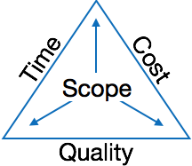

[**_``Go Back``_**](../README.md)

# Managing Software Projects

``Software project management`` is an art and discipline of planning and supervising software projects. It is a sub-discipline of software project management in which software projects ``planned``, ``implemented``, ``monitored`` and ``controlled``.

> It is a procedure of ``managing``, ``allocating`` and ``timing`` resources to develop computer software that fulfills requirements.

## Need for the proper management of software project
------------------------------------------------------

A ``Software Project`` is the complete procedure of software development from requirement gathering to testing and maintenance, carried out according to the execution methodologies, in a specified period of time to achieve intended software product.

Software is said to be an intangible product. Software development is a kind of all new stream in world business and there’s very little experience in building software products. Most software products are tailor made to fit client’s requirements. The most important is that the underlying technology changes and advances so frequently and rapidly that experience of one product may not be applied to the other one. All such business and environmental constraints bring risk in software development hence it is essential to manage software projects efficiently.

The image above shows triple constraints for software projects. It is an essential part of software organization to deliver quality product, keeping the cost within client’s budget constrain and deliver the project as per scheduled. There are several factors, both internal and external, which may impact this triple constrain triangle. Any of three factor can severely impact the other two.

Therefore, software project management is essential to incorporate user requirements along with budget and time constraints.

## Managemet Activites:
-----------------------

### **Project planning**

Planning of a software project is a task that starts before the development process. Its main activities include project scope: defines the scope of the project, project estimation: estimate the project effectively and efficiently. It includes software size estimation, effort estimation, time estimation and cost estimation, Scheduling: specify the completion of the project within a specified schedule and Staffing: all resources used in the development of software product. It may be human resource, software tools, software libraries, etc. Project planning also includes risk analysis: analyze any unfavorable event that may occur during the project development, configuration management: tracking and controlling changes in software in terms of requirements, design, function and development.

### **Estimating Project**

For an effective management accurate estimation of various measures is a must. With correct estimation managers can manage and control the project more efficiently and effectively.

Project estimation may involve the following:

**``Software size estimation:``** Software size may be estimated either in terms of KLOC (Kilo Line of Code) or by calculating number of function points in the software. Lines of code depend upon coding practices and Function points vary according to the user or software requirement.

**``Effort estimation:``** The managers estimate efforts in terms of personnel requirement and man-hour required to produce the software. For effort estimation software size should be known. This can either be derived by managers’ experience, organization’s historical data or software size can be converted into efforts by using some standard formulae.

**``Time estimation:``** Once size and efforts are estimated, the time required to produce the software can be estimated. Efforts required is segregated into sub categories as per the requirement specifications and interdependency of various components of software. Software tasks are divided into smaller tasks, activities or events by ``Work Breakthrough Structure (WBS)``. The tasks are scheduled on day-to-day basis or in calendar months.

The sum of time required to complete all tasks in hours or days is the total time invested to complete the project.

**``Cost estimation:``** This might be considered as the most difficult of all because it depends on more elements than any of the previous ones. For estimating project cost, it is required to consider -

- Size of software
- Software quality
- Hardware
- Additional software or tools, licenses etc.
- Skilled personnel with task-specific skills
- Travel involved
- Communication
- Training and support

### **Project Scheduling**

``Project Scheduling`` in a project refers to roadmap of all activities to be done with specified order and within time slot allotted to each activity. Project managers tend to define various tasks, and project milestones and arrange them keeping various factors in mind. They look for tasks lie in critical path in the schedule, which are necessary to complete in specific manner (because of task interdependency) and strictly within the time allocated. Arrangement of tasks which lies out of critical path are less likely to impact over all schedule of the project.

For scheduling a project, it is necessary to -

- Break down the project tasks into smaller, manageable form
- Find out various tasks and correlate them
- Estimate time frame required for each task
- Divide time into work-units
- Assign adequate number of work-units for each task
- Calculate total time required for the project from start to finish

### **Risk Management**

``Risk management`` involves all activities pertaining to identification, analyzing and making provision for predictable and non-predictable risks in the project. Risk may include the following:

- Experienced staff leaving the project and new staff coming in.
- Change in organizational management.
- Requirement change or misinterpreting requirement.
- Under-estimation of required time and resources.
- Technological changes, environmental changes, business competition.

### **Managing people**

- Act as project leader
- Liaison with stakeholders
- Managing human resources
- Setting up reporting hierarchy etc.